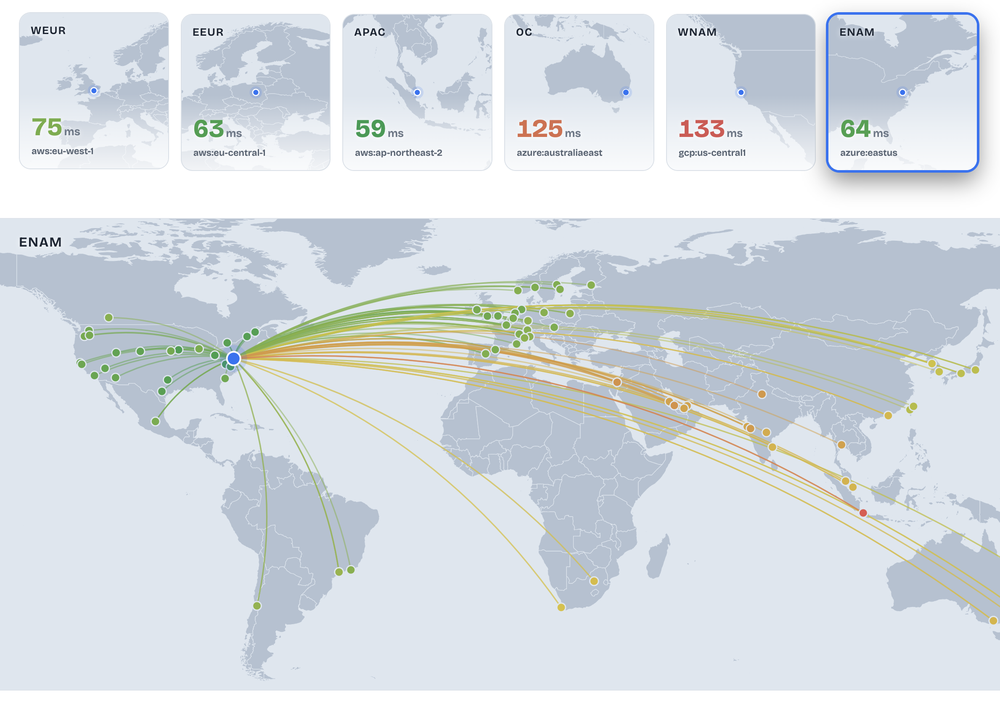

# Cloudflare D1-to-Worker Latency Analytics

When a user calls a Cloudflare Worker that queries a D1 database, D1 round trips can add latency to the final response, especially when a request runs multiple sequential D1 queries.

This benchmark measures the latency between D1 and a Worker when that Worker is pinned to a specific third-party cloud region, such as AWS, GCP, or Azure, using Cloudflare's [`region` placement configuration](https://developers.cloudflare.com/workers/configuration/placement/#specify-a-cloud-region).

### Best worker location per D1 region (p95)

[View full analytics report](https://maxceem.github.io/cf-d1-to-worker-region-latency-analytics/)



## Run

```bash
CLOUDFLARE_API_TOKEN=... npm run benchmark
```

The default run uses [benchmark.config.json](benchmark.config.json). It benchmarks all the D1 locations from [data/d1-locations.json](data/d1-locations.json) against all the Worker regions from [data/*-regions.json](data/), writes results to `results/raw.json`, builds the static report, and opens it.

The `CLOUDFLARE_API_TOKEN` needs these account permissions:

- `D1:Edit`
- `Workers Scripts:Edit`
- `Account Settings:Read` if you do not set `accountId` in config or `CLOUDFLARE_ACCOUNT_ID`

## Partial Run

If you want to test only particular pairs of D1 and Worker regions, use [benchmark.config.partial.json](benchmark.config.partial.json) as a starting point.

Set `workerPlacementsByD1Location`. Object keys are D1 locations; values are the Worker placements to test for that D1 location.

```json
{
  "workerPlacementsByD1Location": {
    "enam": ["aws:us-east-1", "gcp:us-east4", "azure:eastus2"],
    "oc": ["aws:ap-southeast-2", "gcp:australia-southeast1", "azure:australiaeast"]
  }
}
```

And then run benchmark using partial config:

```bash
CLOUDFLARE_API_TOKEN=... npm run benchmark -- --config benchmark.config.partial.json
```

## Cleanup

Temporary resources are deleted after a normal run. If a run is interrupted and anything is left behind, clean up any stale resources with:

```bash
npm run cleanup
```

## License

MIT
